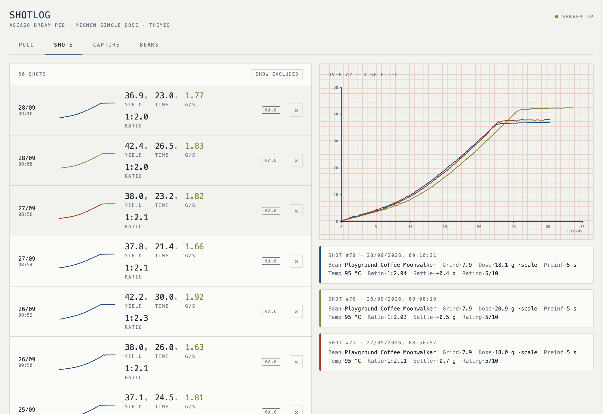
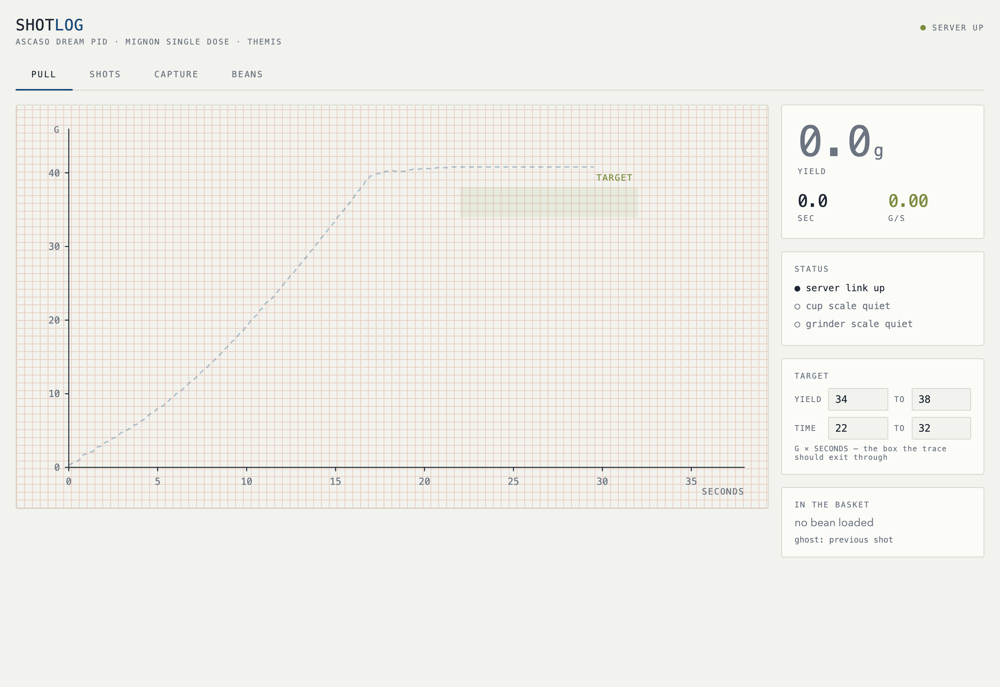
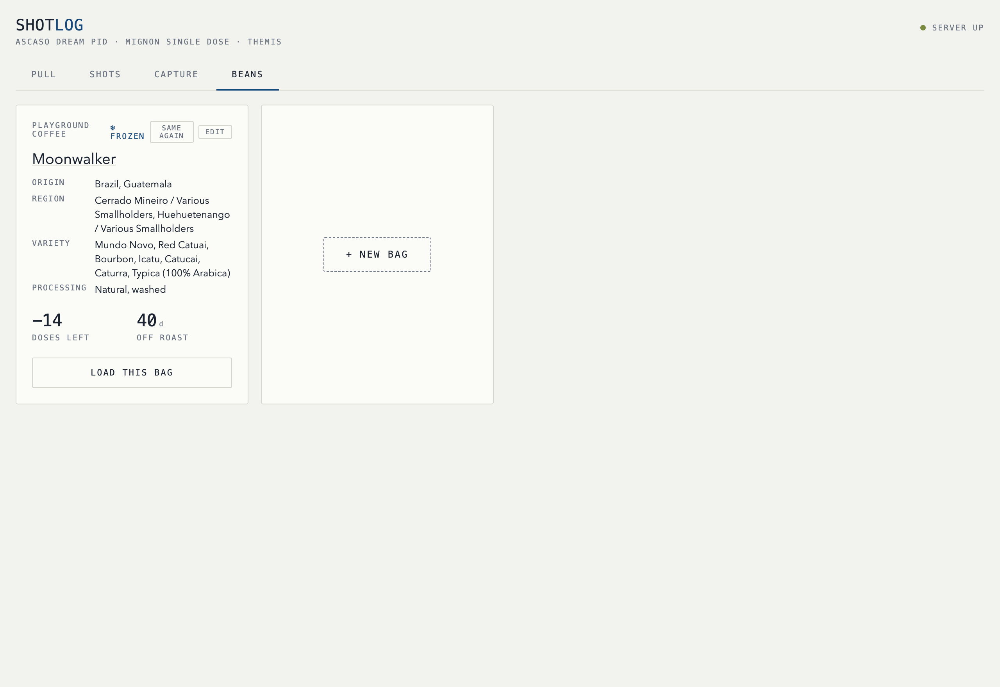
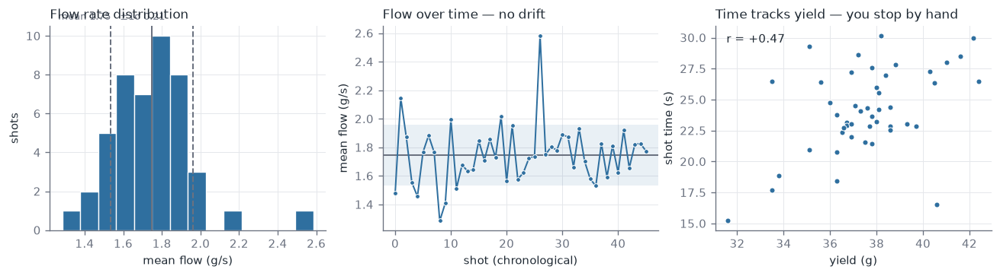

# espressolog — a tour

What it is: an ESP32-S3 watches two Bluetooth scales, works out on its own when
a shot started and stopped, and hands the curve to a small Go service that keeps
it in SQLite and draws it. No buttons to press while holding a portafilter.

---

## The log



Every shot, newest first, with its own sparkline. Tap any of them to overlay
their curves on the same axes — here three consecutive mornings on the same
recipe, which is what "repeatable" actually looks like.

The `0A.6` badge on each row is the **detector version** that measured it. That
is not decoration: the algorithm has been through six versions, each drawing
the line between "pouring" and "stopped" slightly differently. Mixing them in an
analysis inflates the variance for no physical reason, so every row carries the
provenance of its own numbers.

---

## While it's pouring



The curve draws live over a WebSocket as the shot happens, against a target box
you should exit through — grams by seconds, not a stopwatch. The ghost trace
behind it is the previous shot on the same recipe.

The three status dots are the whole health check: is the server up, is the cup
scale awake, is the grinder scale awake. That's all you can usefully glance at
with both hands full.

---

## Beans



Origin, region, variety, processing, days off roast, doses remaining. "Same
again" copies the last bag's details into a new one, because typing a Guatemalan
smallholder's name twice is how logging habits die.

Doses count down as shots are pulled. Going negative, as here, just means the bag
outlasted its nominal dose count.

---

## Two things it found

### The machine's own display, decoded

The Ascaso's mainboard drives its front display over a two-wire link. It is
**not I²C**, though sigrok's I²C decoder will happily "decode" it as endless
writes to address `0x00` — which is how you know you're on the wrong track. It's
plain synchronous serial: ~9.9 kHz clock, data sampled on the rising edge,
133-bit frames every ~41 ms, three seven-segment fields at fixed bit offsets.

Idle it carries **boiler temperature**. During a brew the machine takes the
display over for its **own shot timer, in tenths of a second** — which is a
truer pump-on/pump-off boundary than anything a scale can infer.

The decode validates against itself: the timer ran `001` → `169` across
16.8915 s of capture time. That is 168 displayed steps — 16.8 s — so the
error is **+92 ms**, of the order of the display's own 100 ms tick plus the
~41 ms frame period. (An earlier version of this line claimed "eight
milliseconds of agreement" by comparing against the *final displayed value*
rather than the interval. The same mistake is recorded, and corrected, in
CLAUDE.md for the 2026-10-03 captures.)

Protocol and probe point in [CLAUDE.md](../CLAUDE.md), decoder in
[tools/decode-display-bus.py](../tools/decode-display-bus.py), raw captures in
[analysis/captures](../analysis/captures).

### The noise floor



46 shots, one bean, one grind setting, one grind epoch, one detector version:

**σ = 0.21 g/s on mean flow — 12.2 %.**

The middle panel is the one that matters. If flow were drifting across five
weeks, the spread would be burr wear or a dosing change rather than shot-to-shot
noise, and pooling the shots would be invalid. It isn't drifting, so they pool.

The right panel explains part of the time spread: shot time tracks yield,
because the shot is stopped by hand when the scale reads target. That makes flow
the cleaner repeatability metric — it's a rate, independent of where you stopped.

Why it matters: any closed-loop controller trying to resolve differences smaller
than ~12 % is chasing noise. That's a demanding floor, and it's the honest
go/no-go this project exists to produce. Workings in
[analysis/0f-noise-floor.ipynb](../analysis/0f-noise-floor.ipynb).

---

## How it fits together

```
Bookoo ×2 ──BLE──► ESP32-S3 ──WebSocket──► Go service ──► SQLite
                    (buffer     (live)         │
J5 display bus ───►  in RAM)                   ├─► serves the PWA
                          ──HTTP POST──►       └─► MQTT summary ──► Home Assistant
                            (shot complete)
```

The tablet only ever talks to the Go service. Web Bluetooth doesn't exist on
iPadOS in any browser, and a sleeping tablet must never be able to lose a shot —
so the ESP32 owns the radio and the timing, spools every shot to flash, and
deletes its copy only once the server has confirmed receipt.

Current state and what's next: [phase-0-status.md](phase-0-status.md).
